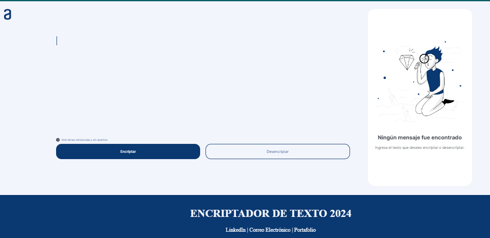
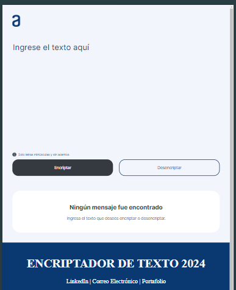
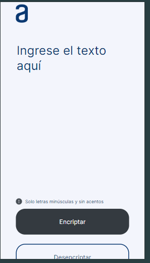

# Encriptador de Texto

## Descripción

El Encriptador de Texto es una aplicación web que permite a los usuarios encriptar y desencriptar mensajes de texto. Esta herramienta es útil para tratar de que el mensaje no pueda ser descubierto y jugar con nuestros amigos encriptando de la información textual y asegurarse de que solo las personas que tengan esta aplicación web puedan leer los mensajes.

## Características

- **Encriptación de texto:** Convierte el texto ingresado en un formato cifrado.
- **Desencriptación de texto:** Transforma el texto cifrado de vuelta a su formato original.
- **Interfaz de usuario intuitiva:** Incluye un área de texto para la entrada y botones claramente marcados para encriptar y desencriptar.
- **Copiar texto:** Permite copiar el texto encriptado o desencriptado al portapapeles con un solo clic.
- **Compatibilidad móvil:** Diseño responsivo que se adapta a dispositivos móviles y tabletas.

## Tecnologías Utilizadas

- **HTML5:** Estructura de la aplicación web.
- **CSS3:** Estilos y diseño visual de la aplicación.
- **JavaScript:** Funcionalidad de encriptación y desencriptación.
- **Google Fonts:** Fuentes personalizadas para una mejor presentación visual.

## Uso

1. **Clonar el repositorio:**

   ```sh
   git clone https://github.com/tu_usuario/encriptador-de-texto.git

2. **Navegar al directorio del proyecto:**

   ```sh
   cd encriptador-de-texto

3. **Abrir el archivo index.html en un navegador web:**
    Simplemente abre el archivo index.html en tu navegador para comenzar a utilizar la aplicación.

4. **Anexos de la compatabilidad de dispositivos**

    
    
    
